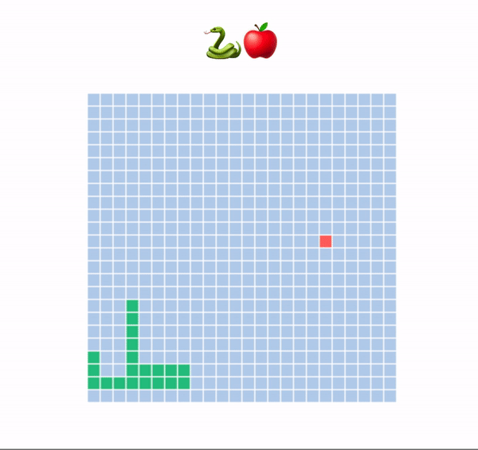

  <h1><code>Snek 🐍</code></h1>
  <h3>Browser Snake Game</h3>
  
Try it: <a href="https://snek-rust-wasm.surge.sh/">https://snek-rust-wasm.surge.sh/</a>

  Built with 🦀🕸<a href="https://rustwasm.github.io/">The Rust and WebAssembly Working Group</a>

